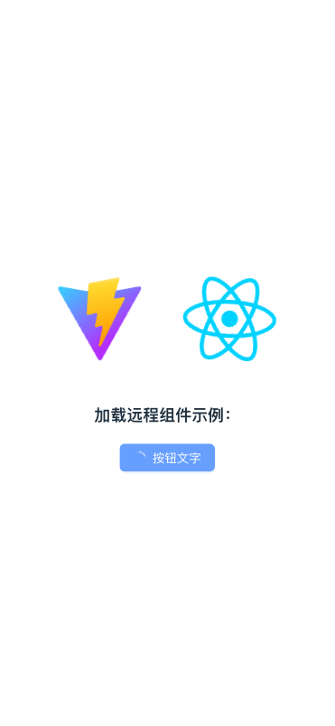
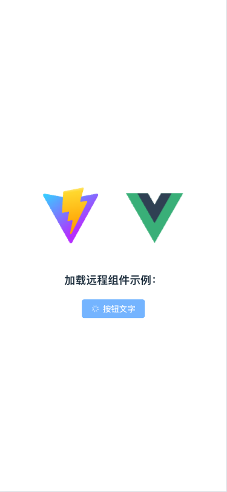

# Import-Remote-Component

异步加载远程组件。

## react-demo

- 展示了 Antd-v5 加载远程按钮组件示例，[在线预览](https://stackblitz.com/edit/vitejs-vite-2g2fpe?terminal=dev)



- 如何使用

```tsx
import React from "react";
import ReactDOM from "react-dom";
import dayjs from "dayjs";
import LoadRemoteComponent from "./components/LoadRemoteComponent";

<LoadRemoteComponent
  urls={["https://cdnjs.cloudflare.com/ajax/libs/antd/5.16.2/antd.min.js"]}
  name="antd.Button"
  options={{
    props: {
      type: "primary",
      loading: true,
    },
    externals: {
      react: {
        import: React,
        export: "React",
      },
      "react-dom": {
        import: ReactDOM,
        export: "ReactDOM",
      },
      dayjs: {
        import: dayjs,
        export: "dayjs",
      },
    },
  }}
>
  按钮文字
</LoadRemoteComponent>;
```

## vue-demo

- 展示了 Element-plus 加载远程按钮组件示例，[在线预览](https://stackblitz.com/edit/vitejs-vite-chrzxj?terminal=dev)



- 如何使用

```vue
<template>
  <LoadRemoteComponent
    :urls="urls"
    name="ElementPlus.ElButton"
    :options="options"
  >
    按钮文字
  </LoadRemoteComponent>
</template>

<script setup lang="ts">
import { ref, onMounted } from "vue";
import LoadRemoteComponent from "./components/LoadRemoteComponent/Index.vue";

const urls = ref([
  "https://cdnjs.cloudflare.com/ajax/libs/element-plus/2.7.0/index.full.min.js",
  "https://cdnjs.cloudflare.com/ajax/libs/element-plus/2.7.0/index.min.css",
]);

const options = ref({
  props: {
    type: "primary",
    loading: true,
  },
  externals: {
    vue: {
      import: "",
      export: "Vue",
    },
  },
});

onMounted(() => {
  import("vue").then((vue) => {
    options.value.externals["vue"].import = vue;
  });
});
</script>
```
